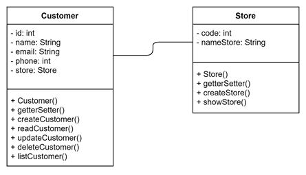
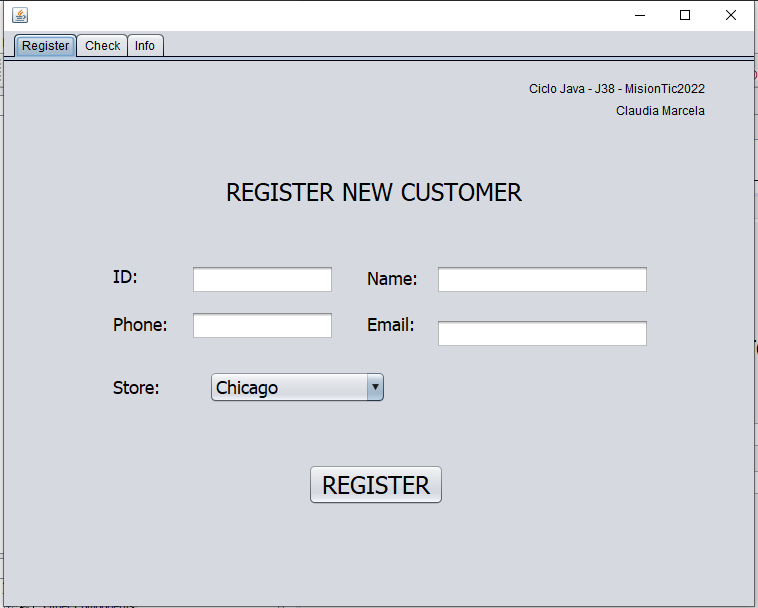
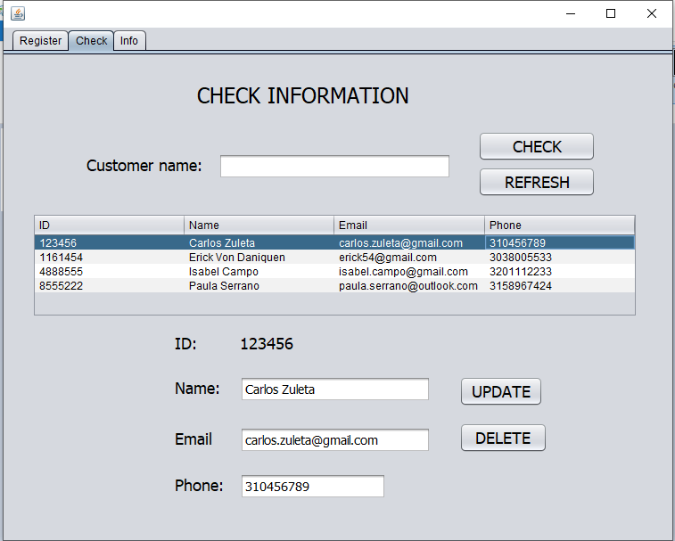

# Customer-Stores Software

_Software to automate the process of creating, consulting, updating and deleting customers in the store database._

## Developed with 🛠️

_This sofware was developed with Java with an object-oriented programming approach, with MVC pattern. The following tools were used:_
* NetBeans - IDE for code writing
* Java Swing - Framework for the graphical interface
* phpAdmin - MySQL database manager

## Database design 📋

_The relational database structure is as follows:_

| Class diagram | Entity-relationship model |
| ------ | ------ |
|  |  |

| Relational model |
| ------ |
|  |

## Executing 🚀

_These screenshots display the functionalities of the software:_

* Register a new customer on database

* Search a specific customer by his name
* See all customers registered on database
* Update some information about a selected customer
* Delete a customer from database

## Project date 📌

2021